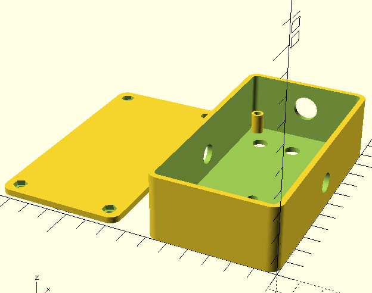

# Parametric Guitar Pedal Enclosure

A fully customizable 3D-printable guitar pedal enclosure designed in OpenSCAD, inspired by classic Hammond die-cast boxes. Create professional-looking enclosures in multiple standard sizes or define your own custom dimensions.



## Features

- **Parametric Design**: Adjust every dimension and component hole size via the OpenSCAD Customizer
- **Multiple Presets**: Choose from Hammond standard sizes (1590A, 1590B, 1590BB, 125B) or design custom dimensions
- **Two-Part Assembly**: Open-bottom shell with removable lid for easy component mounting
- **Complete Controls**: Pre-configured holes for:
  - Potentiometer knobs (configurable count and positions)
  - Footswitch
  - LED indicator
  - 1/4" input and output audio jacks
  - DC barrel jack for power
- **Screw Bosses**: Built-in corner screw mounting posts with configurable counterbores
- **Smooth Curves**: Rounded corners and edges for a professional finish
- **Print-Ready**: Includes flipping options to optimize for 3D printing

## Getting Started

### Requirements

- **OpenSCAD** (free, open-source 3D CAD tool): [Download](https://openscad.org/)
- A 3D printer or 3D printing service

### Installation

1. Clone the repository:
   ```bash
   git clone https://github.com/grahamfranz/Pedal-Enclosure.git
   cd Pedal-Enclosure
   ```

2. Open `pedal_enclosure.scad` in OpenSCAD

## Usage

### Quick Start with Presets

1. In OpenSCAD, go to **Window > Customizer**
2. Under the `[Preset]` section, select a preset size:
   - `1590A` - Small (92.5 × 38.5 × 31 mm)
   - `1590B` - Medium (112 × 60 × 31 mm) — *default*
   - `1590BB` - Large (119 × 94 × 34 mm)
   - `125B` - XL (121 × 66 × 39 mm)
3. Choose a render option under `[Render]`:
   - `enclosure` - Just the main shell (top side up)
   - `lid` - Just the bottom plate (base plate up)
   - `both` - Both parts positioned for printing (with default flip options)
   - `assembled` - Parts together to see the final result
4. The default settings use **hex nut fasteners, board standoffs enabled, no corner bosses, and flipped print orientation** — ideal for most builds
5. Click **F5** to preview or **F6** to render
6. Export as STL when ready to print

### Custom Dimensions

1. Set `preset` to `custom`
2. Enter your desired dimensions in the `[Custom Outer Size]` section:
   - `custom_length` - X axis (long direction)
   - `custom_width` - Y axis (short direction)
   - `custom_height` - Z axis (vertical)

### Customize Components

The Customizer provides sections for fine-tuning:

- **[Shell]** - Wall thickness, corner radius, smoothness
- **[Screw Mounting]** - Boss type (on/off), diameter, inset, clearances, counterbores, and fastener type (`self_tap`, `hex_nut`, `square_nut`)
- **[Lid Locating Lip]** - A raised plug on the lid that drops into the enclosure cavity, preventing lid shear under foot pressure
- **[Board Mount]** - Standoff diameter and height (optional posts hanging from the top wall for proto board mounting)
- **[Top: Knobs]** - Number, spacing, hole diameter
- **[Top: Footswitch]** - Hole size and position
- **[Top: LED]** - Hole diameter and position (optional)
- **[Sides: Audio Jacks]** - Hole sizes and heights
- **[Back: DC Jack]** - Hole size and height (optional)

### Coordinate System

The design uses a standard orientation (top-down view):

```
      +X  (back edge — DC jack)
   +-------------------+
   |       [dc]        |
   |  o   o   o   o    | knob row
[O]|                   |[I] -Y = output, +Y = input
   |        *          | LED
   |                   |
   |       ( X )       | footswitch
   |                   |
   +-------------------+
      -X  (toe)
```

## Printing Tips

- **Enclosure orientation**: Controlled by `flip_enclosure_for_print` (default `true` — top face on bed for the cleanest finish on the labeled side)
- **Lid orientation**: Controlled by `flip_lid_for_print` (default `true` — nut pockets face upward, away from the bed, so they don't sag during printing; the raised locating plug prints first as a solid foundation)
- **Support Material**: With both flip options on, neither part needs supports
- **Tolerance**: Adjust `lid_clearance_d` and `screw_hole_d` if you have fit issues with your printer
- **Wall Thickness**: For durability, keep at least 2–2.5 mm walls
- **Lid thickness**: Use at least 3 mm when using hex/square nut modes; the raised lip will be `lip_height` taller (default 1.5 mm)
- **Locating lip fit**: The plug is sized to the cavity inner profile minus 0.3 mm clearance so it slips in smoothly without binding

## Assembly

### Fastener Options

Choose a method in the `[Screw Mounting]` section:

| `boss_fastener` | Hardware needed | Notes |
|---|---|---|
| `self_tap` | M3 self-tapping screws (from below) | Simple, but repeated opening/closing will eventually strip the plastic |
| `hex_nut` *(default)* | M3 hex nuts + M3 machine screws (from above) | Screw enters the top face, passes down through the corner, and threads into a hex nut pocket captive in the lid's underside — provides reusable fastening |
| `square_nut` | M3 square nuts + M3 machine screws (from above) | Same as hex, but with a square pocket which is easier to print accurately |

**Note:** Nut modes recess the nut pocket into the lid's underside, so set `lid_thickness` to at least `nut_pocket_depth + 0.6` mm (default 3 mm is recommended for M3).

For nut modes, set `nut_pocket_depth` to match your nut (hex ≈ 2.4 mm, square ≈ 1.8 mm).

### Assembly Steps

1. Print both parts (use default flip settings for cleanest results)
2. *(Hex/square nut modes only)* Drop an M3 nut into each nut pocket on the lid's underside
3. Install your components (pots, jacks, footswitch, LED) into the pre-drilled holes
4. *(Optional: board standoffs)* Insert your proto board (e.g., CircuitMesh) from below the enclosure, aligning its screw holes with the standoffs, then secure from underneath
5. Insert screws from the top into the corner posts and tighten (they will thread into the nut pockets on the lid's underside)
6. Mount the lid to close the enclosure — the raised locating plug will drop into the cavity for a snug, shear-resistant fit

## Pre-Rendered STL Files

All preset Hammond enclosures are available as pre-rendered STLs in the `renders/` directory, ready for immediate 3D printing. Each preset is exported in three configurations:

| Preset | Size (mm) | Enclosure | Lid | Both |
|--------|-----------|-----------|-----|------|
| **1590A** | 92.5 × 38.5 × 31 | `1590A_enclosure.stl` | `1590A_lid.stl` | `1590A_both.stl` |
| **1590B** | 112 × 60 × 31 | `1590B_enclosure.stl` | `1590B_lid.stl` | `1590B_both.stl` |
| **1590BB** | 119 × 94 × 34 | `1590BB_enclosure.stl` | `1590BB_lid.stl` | `1590BB_both.stl` |
| **125B** | 121 × 66 × 39 | `125B_enclosure.stl` | `125B_lid.stl` | `125B_both.stl` |

**Note**: The 1590A preset uses 2 knobs (optimized for the tight 38.5mm width), while all other presets use 3 knobs.

### Quick Print Guide

- **Use `*_both.stl` files** for a complete assembly view with both parts positioned for printing
- **Use individual `*_enclosure.stl` and `*_lid.stl` files** if you prefer to print them separately or scale one part differently

## File Structure

```
Pedal-Enclosure/
├── README.md                  # This file
├── LICENSE                    # MIT License
├── pedal_enclosure.scad       # Main OpenSCAD design
└── renders/
    ├── preview.png            # Visual preview
    ├── 1590A_enclosure.stl     # Pre-rendered STL (small, 2 knobs)
    ├── 1590A_lid.stl
    ├── 1590A_both.stl
    ├── 1590B_enclosure.stl     # Pre-rendered STL (medium, 3 knobs)
    ├── 1590B_lid.stl
    ├── 1590B_both.stl
    ├── 1590BB_enclosure.stl    # Pre-rendered STL (large, 3 knobs)
    ├── 1590BB_lid.stl
    ├── 1590BB_both.stl
    ├── 125B_enclosure.stl      # Pre-rendered STL (XL, 3 knobs)
    ├── 125B_lid.stl
    └── 125B_both.stl
```

## Customization Examples

### Reduce Material: Thin-Walled Version
- Decrease `wall_thickness` to 1.5 mm
- Decrease `lid_thickness` to 1.2 mm

### Smoother Finish: High-Detail Render
- Increase `facets` from 72 to 96 or higher (slower render)

### More Knobs
- Increase `num_knobs` and adjust `knob_side_margin` for spacing

### Hide Optional Components
- Set `include_led` to `false` to remove the LED hole
- Set `include_dc_jack` to `false` to remove the DC jack

## License

This project is licensed under the MIT License. See [LICENSE](LICENSE) for details.

## Contributing

Feel free to fork, modify, and share improvements. If you have suggestions or find issues, please open an issue on GitHub.

## Credits

Designed by Graham Franz. Inspired by the classic Hammond die-cast enclosure series.

---

**Tips**: For the best results, always preview your design in OpenSCAD before printing. Test-fit your components (pots, jacks) in the STL file to ensure proper spacing and clearance.
